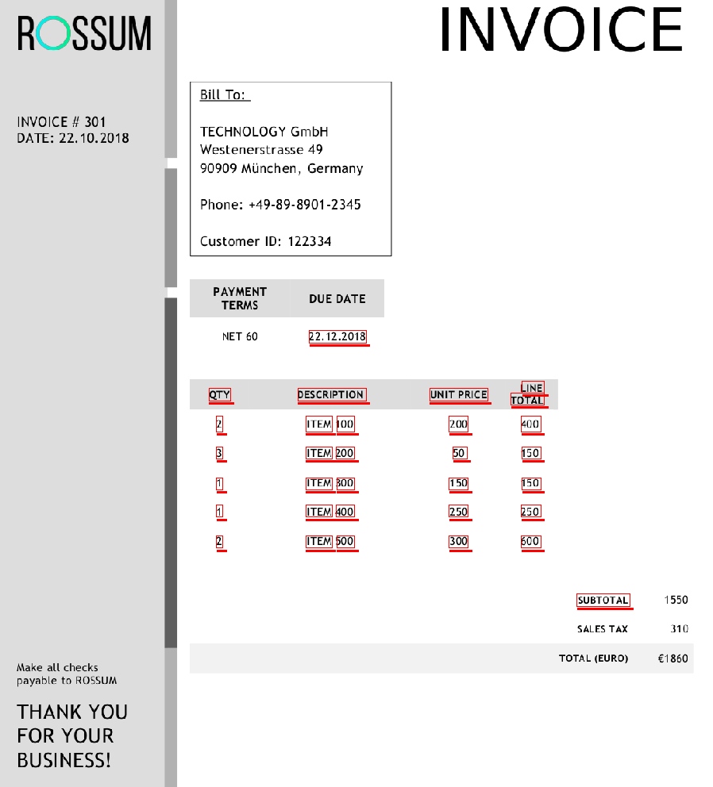

# flying-rectangles
A repository with anonymized invoices. Total number of documents is 3741.  
  
The format is a json with one big list. In the list, there are tuples, in the format:  
(#document_id, (boundingbox cordinates left, top, right, bottom), page number of the document, field type, (anonymized text features - 17 floats OR None) )  
  
Field type is either 'text', that is a word from the original pdf file, in which case the features are 17 floats. Or something else, which means it is an annotation and has None in place of text features.  
  
The original invoices do look like the provided sample:  
  
The red underlined boxes are examples of some word's boundingboxes (not all boundingboxes are shown for simplicity reasons).
  
